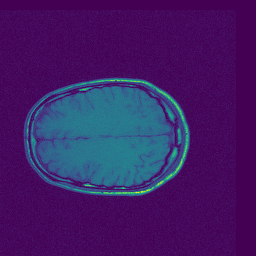
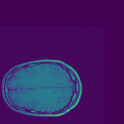
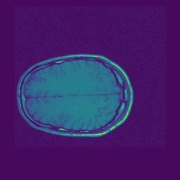

# Automatic-2DImages-Registration

*This is a project within our school curriculum. Topic proposed by ISEN Yncréa Ouest.*
  
Work in collaboration with the best binom @ElouanHocine

 
 

## Content of the repertory
This folder contains everything needed to run the different versions of the algorithms presented in the report.
To operate these algorithms, several specifications are required: 
Python3 or higher, and the following modules:
numpy
nibabel
matplotlib
scipy
LIP

### PROGRAMMES

-**_Recalage.py_**: This program is the basic version of the registration algorithm. It allows the registration of modality images 
identical or different, but identical in size. This is done according to translations.
[Go to this project](Recalage.py)

-**_Recalage_ModaliteDiff.py_**: This evrsion makes it possible to check the correct operation of the program on 2 different modalities,
by superimposing the 2 final images obtained at 50% of their intensity.
[Go to this project](Recalage_ModaliteDiff.py)

-**_Recalage_Flou.py_**: This version of the algorhitme works in 2 steps, using Gaussian blur. It is used with
the same conditions as the first two.
[Go to this project](Recalage_Flou.py)

-**_Recalage_InfoMutuelle.py_**: This version of the algorithm performs a registration using the mutual information calculation,
to recalculate multimodal images. It uses the functions present in the MI.py file
[Go to this project](Recalage_InfoMutuelle.py)

### FOLDERS

-**_FilesStudents_**: Contains the different images used to run the algorithms
[Go to this folder](FilesStudents)

-**_Images_**: Contains the images obtained at each iteration of the algorithm loop, is automatically cleaned at each
launch of the program.
[Go to this folder](Images)

-**_Results_**: Contains the image obtained at the last iteration of the algorithm, saved in NIfTI format.
[Go to this folder](Results)

 
 

## Results

A usage porposition is available in the files above.
Input images used (File in FilesStudents used): image fixe = [*image1.nii*](fichiersEtudiants/image1.nii) // Image mobile = [*image2.nii*](fichiersEtudiants/image2.nii)
  - View results at each iteration in the Images folder [*(Go to this folder)*](Images)
  - View the final result in the Results folder [*(Go to this folder)*](Results)

The purpose of this code is to superimpose two images that cannot be superimposed initially (translation and rotation of a moving image relative to the reference image).
 
 
Firstly, we have two distinct images:
 
|     | 
|:--:| 
| *Image1 (fixed) vs. Image2 (mobile)* |

 
 

At the end of all iterations, we obtain a recalculation of the two images:
 
|     | 
|:--:| 
| *Image1 (fixed) vs Image2 (mobile) after processing* |

